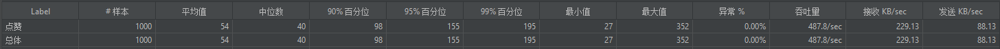
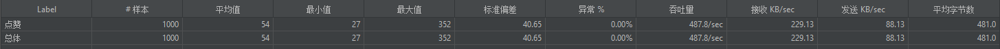
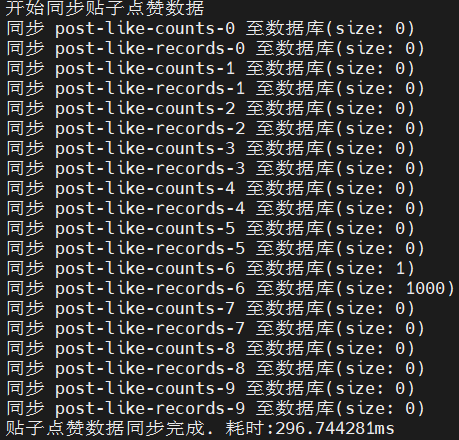
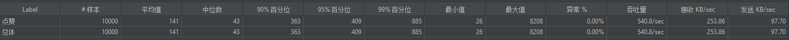
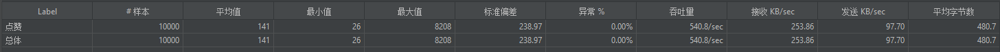
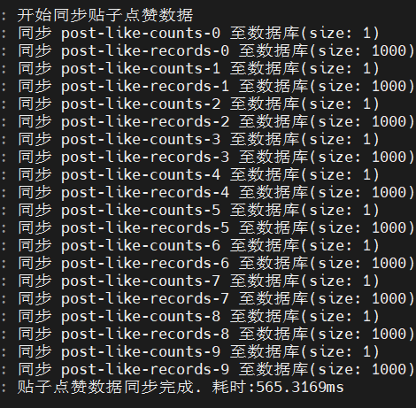

## 点赞接口
* Redis优化后：
  * 1000个用户，对1个贴子点赞
    * 
    * 
    * 同步耗时: 296.744281ms
      * 
  * 1000个用户，对10个贴子点赞
    * 
    * 
    * 同步耗时: 565.3169ms
      * 
  * 1000个用户，对10个贴子点赞，同时不断同步至MySQL并删除记录
    * Redis中删除---写入MySQL的空挡其，出现一致性问题。点赞数量丢失。